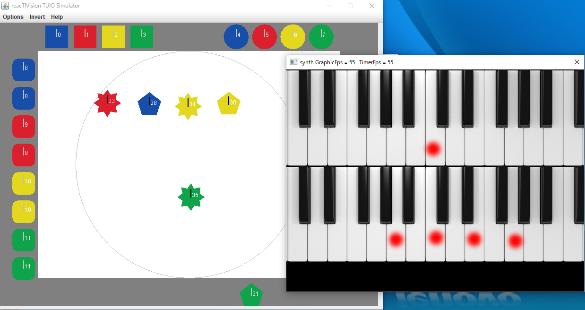

application for IR multitouch display
==========

赤外光を利用したマルチタッチスクリーン上で動作するソフトウェアです。五月祭で展示されました。「infrared multitouch screen」で検索するといろいろな製作記が出てきます。

プログラムはsynthプロジェクトが本体で、タッチ情報の取得や描画/音声デバイスの初期化やAPIの提供などを行います。他のプロジェクトgame/map/piano/smokeの四つはsynthから呼び出されるアプリケーション用のDLLになります。gameはタッチして球を打ち返すホッケーゲーム、mapは展示会場の地図画像などを複数人が並行して確認できる地図アプリ、pianoはASIOデバイスを用いて低レイテンシで音声入出力を行うピアノアプリ、smokeはreal-time fluid dynamics simulationを用いてスモークを用いたデモです。

実機がないと動かせませんが、TUIO Simulatorを利用すると一応動作は確認できます。
マウスも入力デバイスとして使えますが、複数ポインティングができないので一部アプリしか使えません。

ビルドの際には以下を必要とします。

- IR multitouch displayの実機
- Community Core Vision (タッチ情報のラベリングとトラッキング)
- reacTIVision TUIO Client (Community Core Visionの情報の受信クライアント)
- portaudio (音声処理)
- DirectX9 SDK (描画処理)
- fluid2d (Gustav Taxen氏によるfluid dynamics simulationの実装です)
- fftw (fluid simulation用)
- OpenCV (カメラ情報の取得)

個々のアプリケーションはDLLMain.cppの音声、画像、入力に対するコールバックを記述することで作成します。
